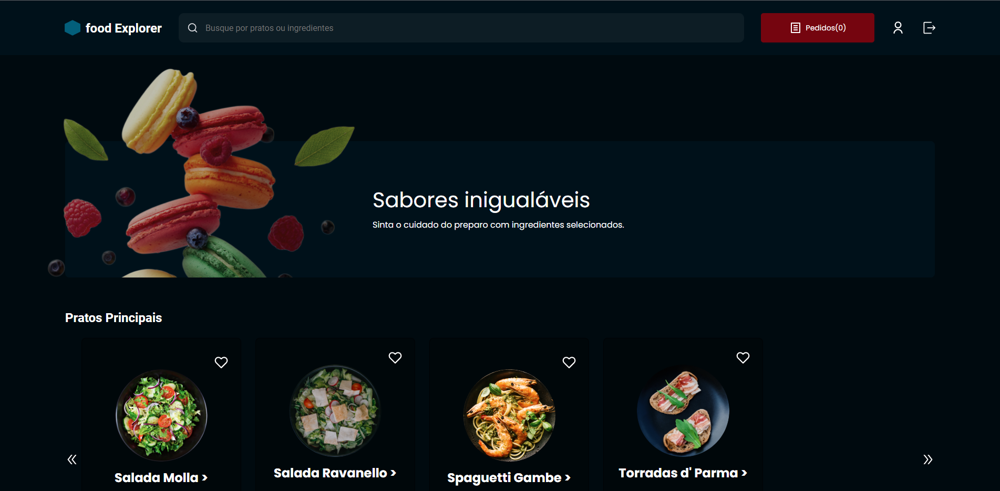

# 🍔Food Explorer - Front-End

* food explorer é uma aplicação que simula o site de restaurante, ou seja um cliente pode fazer pedidos, e administrador gerencia esses pedidos.
 


# 💬Sobre

* Este é o projeto final do programa Explorer da Rocketseat, 
aonde foi proposto a construção de uma aplicação para gerenciar os pedidos de um restaurante. 

# 📝Tecnologias

* ReactJS - utilizado para construir as interfaces;
* JS - usado para fazer toda a lógica da aplicação;
* Styled Components - utilizado para fazer a estilização;
* Git - responsável por realizar o versionamento do código.
* Axios - utilizado para fazer as requisições.
* Vite - usado para criar um projeto React;
* NPM - utilizado para realizar a instalação das dependências;

# 🔨Funcionalidades

* Mostrar todos pratos;
* Mostrar um prato especifico;
* Fazer a busca de um prato pelo nome;
* Adicionar ao carrinho;
* Visualizar o carrinho;
* Criar conta;
* Fazer login;
* Atualizar informações da conta;
* Adicionar um prato aos favoritos;
* Fazer um pedido;
* Ver a todos os seus pedidos;
* Ver os detalhes de um pedido especifico;
* Cadastrar um prato;
* Editar um prato;
* Editar a situação de um pedido;
* Visualizar todos os pedidos feitos por todos os clientes com filtro de data;

# 💡Utilização

* Para utilizar esse projeto localmente, primeiro você precisará instalar o backend conforme essa [documentação](https://github.com/matheusvieira14/food_explorer-Backend_js).

#### Clone o projeto
```` 
git clone https://github.com/matheusvieira14/final_Challenge-food_Exprorer.git 
````

#### Entre no diretório:

```` 
$cd final_Challenge-food_Exprorer
````

#### Instale as dependências:
```` 
$npm install 
````

#### Defina a variável local, conforme o endereço que será gerado no backend. Exemplo:

```` 
baseURL: "https://localhost:3333"
````

#### Inicie um servidor local para o frontend:
```` 
$npm run dev
````

# 🔑Conta administrador:
* Email: 
````
admin@gmail.com
````
* senha: 
````
admin
````

# Autor
Feito por Dev Matheus da Rocha Vieira 😀 Veja meu [LinkedIn](https://www.linkedin.com/in/matheus-vieira-001b46248/).


